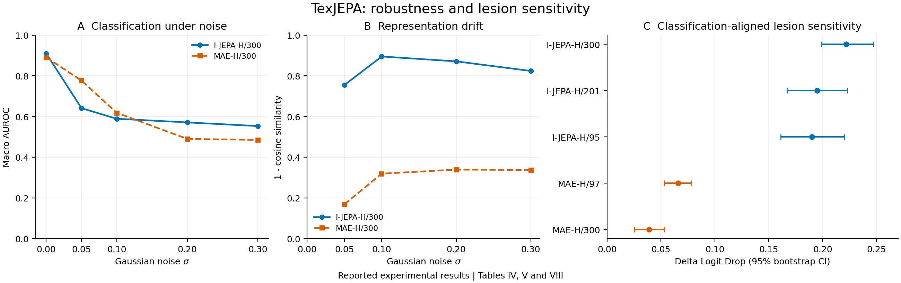
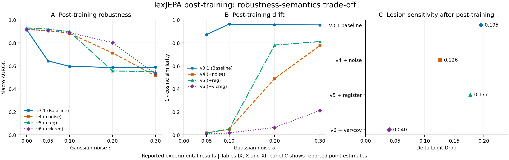

# When Texture Becomes the World: Texture-aware JEPA for Chest X-ray Representation Learning

Research code and experimental results for **TexJEPA**. We study how chest X-ray encoders use radiographic texture: the same fine detail that supports lesion recognition can make a representation sensitive to acquisition noise. Our framework evaluates clean classification, perturbation robustness, representation drift, and lesion sensitivity together, then examines three post-training strategies for balancing these properties.

[Reported results](results/paper/README.md) · [Methods](docs/METHODS.md) · [Execution guide](docs/EXECUTION.md)

## Main findings

We compare MIMIC-CXR-pretrained I-JEPA-H/300 and MAE-H/300 on a deterministic 12,000/3,000 split of VinDr-CXR/VinBigData. Under frozen linear probing, I-JEPA achieves higher clean macro AUROC and stronger lesion sensitivity, but a larger performance drop under light Gaussian noise.

| Model | Clean AUROC | AUROC at σ = 0.05 | Cosine drift at σ = 0.05 | Lesion Δ Logit Drop |
|---|---:|---:|---:|---:|
| I-JEPA-H/300 | 0.910 | 0.641 | 0.755 | 0.222 |
| MAE-H/300 | 0.891 | 0.777 | 0.169 | 0.039 |

These values are transcribed from Tables IV, V, and VIII of our manuscript. Our manuscript is not distributed in this repository. The [reported-results package](results/paper/README.md) preserves their source locations and scope; it contains aggregate measurements, not raw predictions or training logs.



We explore three related post-training variants:

| Variant | Code name | Mechanism |
|---|---|---|
| TexJEPA-N | `v4` | Noisy context predicts a clean EMA target |
| TexJEPA-R | `v5` | Inherits asymmetric noise; adds four register tokens and tighter masking |
| TexJEPA-C | `v6` | Inherits asymmetric noise; adds patch-level variance and covariance regularization |

The variants expose a trade-off: stronger high-noise stability can reduce lesion sensitivity. Clean AUROC alone does not capture this behavior.



## What is included

- Native I-JEPA and MAE training, checkpoint export, and the TexJEPA post-training family.
- Local checkpoint adapters for I-JEPA, MAE, EVA-X, RAD-DINO, and compatible custom backbones.
- Linear probing, MLP probing, and partial fine-tuning.
- Noise, blur, brightness, contrast, and frequency-band diagnostics; image and patch-token drift; classification-aligned lesion occlusion.
- Input smoothing, training augmentation, and noise-consistency adapter experiments.
- Checkpoint resume, explicit data and model provenance, and table/figure export.
- Synthetic CPU tests for formulas, interfaces, data validation, and execution behavior.

## Install

Use Python 3.11 or newer. From the repository root:

```sh
python -m venv .venv
source .venv/bin/activate
python -m pip install -e '.[test]'
```

The core package uses PyTorch, NumPy, Pillow, and Matplotlib. For external backbone adapters:

```sh
python -m pip install -e '.[backbones]'
```

External repositories can require specific dependency versions; see [Backbones](docs/BACKBONES.md). Choose a PyTorch build that supports the target compute environment. The command-line runners use POSIX process locks and are intended for Linux and macOS.

## Quick check

Run the tests and the small synthetic diagnostic pipeline:

```sh
python -m pytest
python -m scripts.run_all --dry-run --profile smoke --output outputs/smoke
```

The smoke command performs bounded CPU computation with synthetic images and small randomly initialized models, and writes diagnostics marked `synthetic_smoke`. These outputs verify the workflow; the manuscript measurements are kept separately in `results/paper/`.

## Run an experiment

Edit [configs/experiment.example.json](configs/experiment.example.json) with the paths, device, preprocessing, split, and checkpoints for the experiment. All `/srv/texjepa/...` values are placeholders. The data and model loaders use existing local files.

```sh
python -m scripts.run_experiments --config configs/experiment.example.json --plan
python -m scripts.run_experiments --config configs/experiment.example.json --validate-inputs
python -m scripts.run_experiments --config configs/experiment.example.json --execute
```

Planning lists the tasks and required assets without constructing models. Input validation checks manifests, split membership, and file availability. Execution runs the configured training and diagnostics, recording each new run separately from the reported aggregates.

For downstream evaluation of existing encoders, set `post_training.enabled` to `false`. The native post-training path requires a compatible **full native I-JEPA checkpoint**, including the predictor and target encoder; an external encoder checkpoint is sufficient only for its downstream adapter. See the [execution guide](docs/EXECUTION.md) for pretraining, resume, evaluation, and output locations.

## Explore the reported results

We provide every manuscript table as CSV and JSON, together with source-page references and the original displayed precision. Validate the exports or regenerate the summary figures without the manuscript PDF, images, checkpoints, or training:

```sh
python scripts/export_paper_results.py --check
python -m scripts.plot_paper_results --output outputs/paper_figures
```

## Documentation

| Guide | Contents |
|---|---|
| [Methods](docs/METHODS.md) | Objectives, metrics, variant lineage, and explicit implementation choices |
| [Execution](docs/EXECUTION.md) | Experiment configuration, training, resume, and reports |
| [Data contract](docs/DATA_CONTRACT.md) | Image manifests, class mapping, bounding boxes, intensity, and splits |
| [Backbones](docs/BACKBONES.md) | Local model recipes, normalization, and checkpoint compatibility |
| [Sources](docs/SOURCES.md) | Study provenance, datasets, and upstream model implementations |
| [Reported results](results/paper/README.md) | Aggregate values and their manuscript provenance |

The repository does not distribute chest radiographs or pretrained checkpoints. Data access follows the terms of the respective datasets. Configuration defaults and adapter choices are documented so that new experiments can be interpreted with their exact preprocessing and assets.

## Citation

Please cite our manuscript when using our code or reported results. A title-based BibTeX entry is available in [CITATION.bib](CITATION.bib). Our manuscript is unpublished and is not distributed in this repository.
