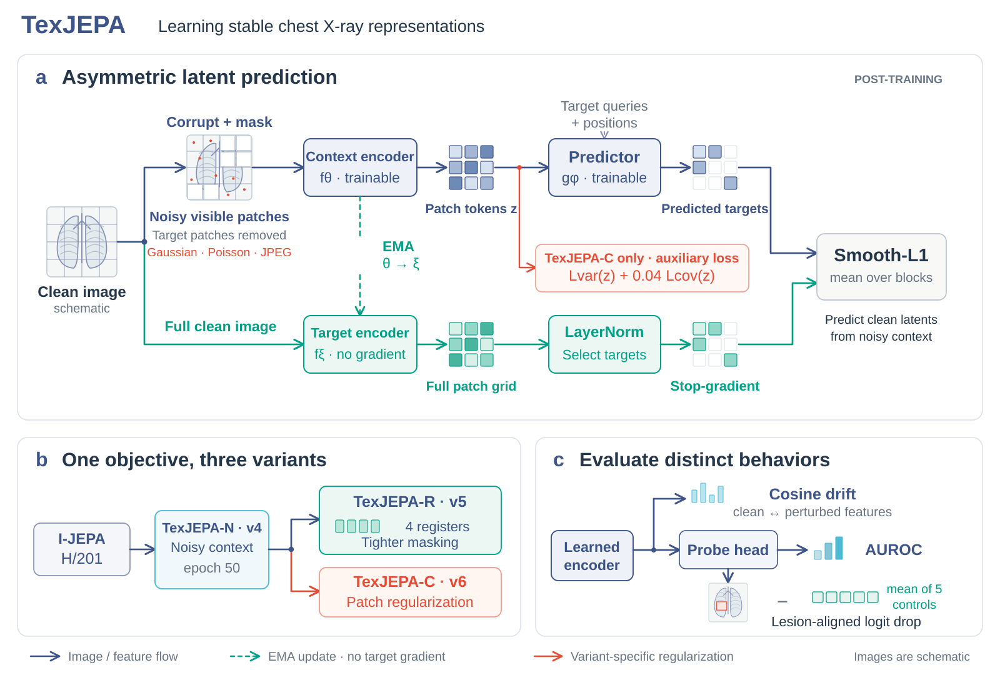
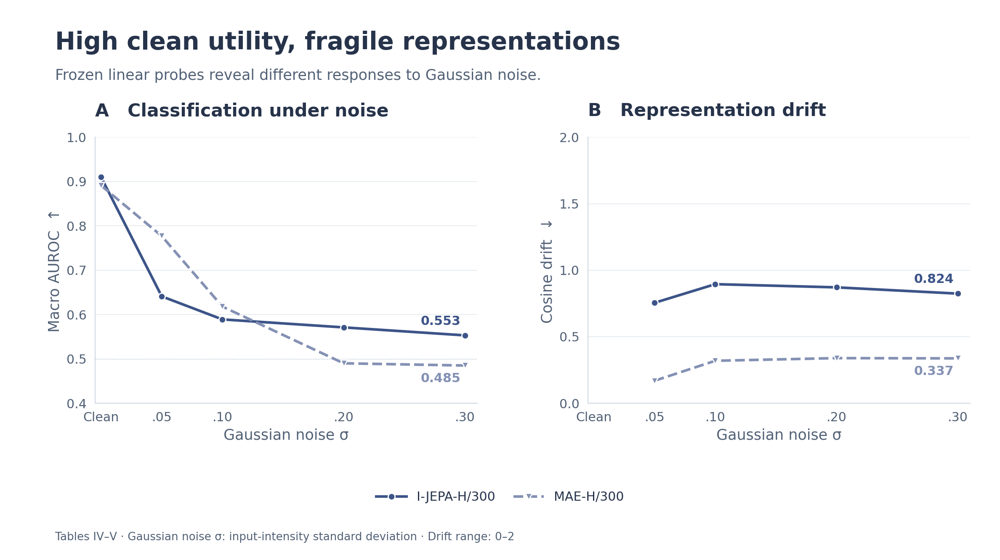
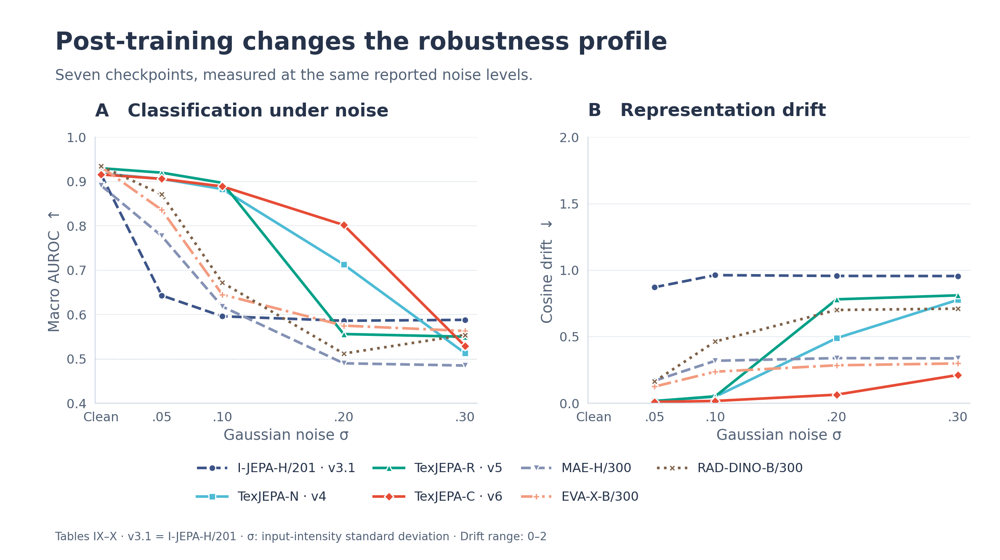
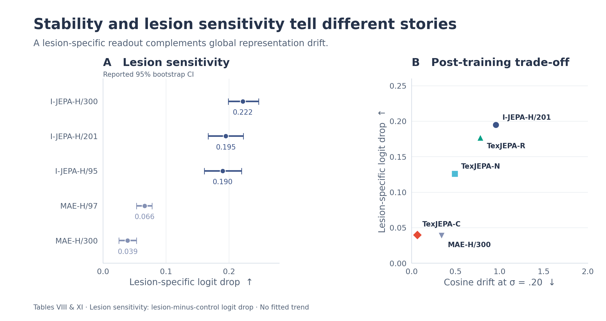
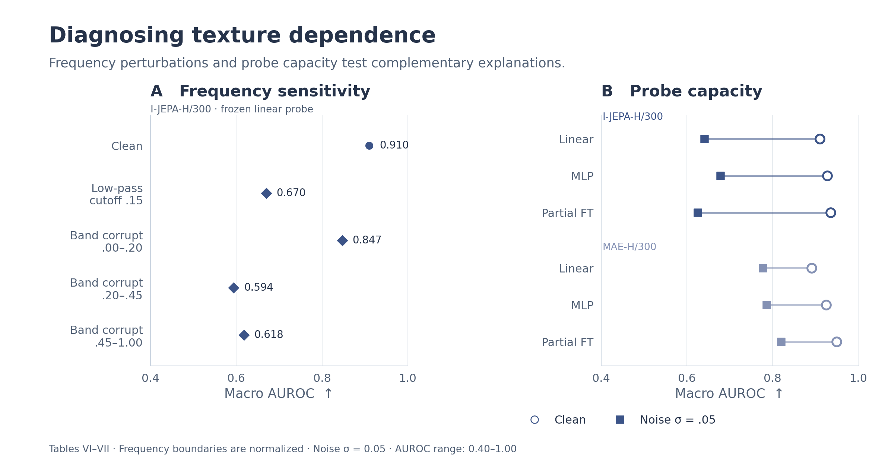

<h1 align="center">TexJEPA</h1>
<p align="center"><strong>Texture-aware JEPA for chest X-ray representation learning</strong></p>

<p align="center">
  <a href="https://github.com/Eric-lfmself/TexJEPA/actions/workflows/tests.yml"></a>
  <a href="#quick-start"></a>
  <a href="pyproject.toml"></a>
</p>

<p align="center">
  <a href="#main-results">Results</a> ·
  <a href="#texjepa-post-training">Method</a> ·
  <a href="#quick-start">Quick start</a> ·
  <a href="docs/EXECUTION.md">Experiments</a> ·
  <a href="#documentation">Documentation</a>
</p>

**Clean accuracy tells only part of the story.** We study how chest X-ray encoders use radiographic texture: sensitivity to fine lesion detail can also make a representation fragile to image noise. TexJEPA combines controlled diagnostics with three I-JEPA post-training variants to examine the balance between classification, noise robustness, and lesion sensitivity.



<p align="center"><em>Predict clean representations from noisy context. Evaluate what becomes stable—and what remains lesion-sensitive.</em></p>

The training panel shows feature flow and the EMA update; the variant panel shows that TexJEPA-R and TexJEPA-C share the same TexJEPA-N parent. [Full-size framework](docs/assets/framework.svg) · [Diagram guide](docs/assets/README.md) · [Objectives and implementation](docs/METHODS.md)

We provide the training and evaluation code, aggregate experimental results, and a small CPU demonstration that requires no images or checkpoints.

## Main results

We compare **MIMIC-CXR-pretrained I-JEPA-H/300 and MAE-H/300** using frozen linear probing on a deterministic **12,000 / 3,000 split of VinDr-CXR/VinBigData**, with 15 binary labels.

| Encoder | Clean AUROC ↑ | Noisy AUROC ↑ | Cosine drift ↓ | Lesion sensitivity ↑ |
|---|---:|---:|---:|---:|
| I-JEPA-H/300 | **0.910** | 0.641 | 0.755 | **0.222** |
| MAE-H/300 | 0.891 | **0.777** | **0.169** | 0.039 |

Noisy AUROC and cosine drift are measured at Gaussian σ = 0.05. Lesion sensitivity is the target-class logit drop from lesion occlusion minus the mean drop from matched non-lesion controls. Sources: [Table IV](results/paper/csv/table_iv.csv), [Table V](results/paper/csv/table_v.csv), and [Table VIII](results/paper/csv/table_viii.csv).

**I-JEPA has stronger clean discrimination and lesion sensitivity, while MAE is more stable under light noise.** This motivates evaluating these properties together.



*Tables IV–V. Markers show reported measurements; connecting lines join the tested noise levels. Cosine drift is 1 − cosine similarity. [Vector figure](results/paper/figures/readme/baseline_robustness.svg).*

## TexJEPA post-training

We start from **I-JEPA-H/201 (`v3.1`)** and train a noisy context branch to predict a clean EMA target. TexJEPA-N introduces this asymmetric noise objective; TexJEPA-R and TexJEPA-C branch from its epoch-50 checkpoint.

| Variant | Post-training change | Clean AUROC ↑ | AUROC at σ = 0.05 ↑ | Lesion sensitivity ↑ |
|---|---|---:|---:|---:|
| I-JEPA-H/201 (`v3.1`) | Baseline | 0.916 | 0.643 | **0.195** |
| **TexJEPA-N** (`v4`) | Asymmetric context noise | 0.918 | 0.906 | 0.126 |
| **TexJEPA-R** (`v5`) | Noise + four register tokens + tighter masking | **0.930** | **0.920** | 0.177 |
| **TexJEPA-C** (`v6`) | Noise + patch variance/covariance regularization | 0.916 | 0.906 | 0.040 |
| MAE-H/300 | Reconstruction baseline | 0.891 | 0.777 | 0.039 |
| EVA-X-B/300 | External encoder | 0.933 | 0.836 | — |
| RAD-DINO-B/300 | External encoder | 0.935 | 0.871 | — |

The post-training baseline is H/201, distinct from the H/300 baseline above. Bold values compare the four I-JEPA variants; the three external rows provide context. A dash indicates that Table XI does not report a lesion score. Sources: [Table XI](results/paper/csv/table_xi.csv) and [Table XII](results/paper/csv/table_xii.csv).

TexJEPA-R gives the strongest clean and light-noise readout among these variants. TexJEPA-C has the lowest drift at σ = 0.20, but substantially lower lesion sensitivity. The [method guide](docs/METHODS.md#texjepa-post-training) gives the objectives, masking changes, and checkpoint lineage.



*Tables IX–X. All seven encoders are shown. TexJEPA-R's light-noise advantage does not persist across the entire noise range; TexJEPA-C's lower drift must be considered alongside its lesion sensitivity. [Vector figure](results/paper/figures/readme/post_training.svg).*

## Lesion sensitivity and the stability trade-off

We compare lesion occlusion with five area-matched non-lesion controls. A larger excess target-class logit drop means the readout is more sensitive to the annotated lesion region.



*Left: Table VIII's reported point estimates and 95% bootstrap confidence intervals. Right: Table XI's paired drift at σ = 0.20 and lesion scores, without inferred intervals or a fitted trend. The H/300 checkpoint comparison and H/201 post-training comparison retain their separate contexts. [Source data](results/paper/csv/table_xi.csv) · [Vector figure](results/paper/figures/readme/lesion_tradeoff.svg).*

The post-training comparison exposes different outcomes: TexJEPA-R retains more lesion sensitivity than N or C, while TexJEPA-C produces the smallest drift. Our evaluation makes both properties visible rather than reducing them to a single score.

## Frequency interventions and probe protocols

Frequency interventions test which image information the encoder depends on. Probe comparisons test whether changing the readout or partially fine-tuning the encoder resolves the sensitivity to noise.



*Left: Table VI's original AUROC values. Right: Table VII's clean and Gaussian σ = 0.05 AUROC for linear probing, MLP probing, and partial fine-tuning. Missing drift entries are not inferred. [Frequency data](results/paper/csv/table_vi.csv) · [Probe data](results/paper/csv/table_vii.csv) · [Vector figure](results/paper/figures/readme/frequency_and_probes.svg).*

For I-JEPA-H/300, partial fine-tuning raises clean AUROC from **0.910 to 0.935**, while AUROC at σ = 0.05 changes from **0.641 to 0.625**. A stronger clean readout alone does not establish robustness.

All **13 tables**, **26 supplementary records**, and **90 Figure 4 annotations** are available in the [results package](results/paper/README.md). Each gallery figure includes its source records and export hashes in the [figure manifest](results/paper/figures/readme/manifest.json).

## Quick start

**Linux or macOS · Python 3.11+ · no dataset or pretrained weights needed**

### 1. Get the code and inspect the results

```sh
git clone https://github.com/Eric-lfmself/TexJEPA.git
cd TexJEPA
python3 scripts/export_paper_results.py --check
```

This first check uses only the Python standard library. It validates 13 tables, 26 supplementary records, 90 figure annotations, and their exports.

### 2. Install and run the CPU demonstration

```sh
python3 -m venv .venv
source .venv/bin/activate
python -m pip install -e '.[test]'
python -m scripts.run_all --dry-run --profile smoke --output outputs/smoke
```

The demo runs the diagnostic workflow with synthetic images and small randomly initialized models. It writes `outputs/smoke/results.json` and a linked table index at `outputs/smoke/tables/INDEX.md`. Demo outputs are labeled `synthetic_smoke`; our experimental measurements are in [`results/paper/`](results/paper/README.md).

### 3. Explore figures or run the tests

```sh
python -m scripts.plot_readme_results --output outputs/readme_figures
python -m pytest
```

Figure generation reads the committed experimental values. Neither command downloads medical images or model weights. For GPU experiments, install a PyTorch build appropriate to the execution machine before installing the package.

## Run an experiment

We support native **I-JEPA / MAE pretraining**, **TexJEPA post-training**, and downstream evaluation through local **I-JEPA, MAE, EVA-X, RAD-DINO, and custom backbone adapters**. Evaluation includes linear and MLP probes, partial fine-tuning, image and token drift, lesion occlusion, frequency interventions, input smoothing, and noise-consistency adapters.

1. Prepare the images, label manifest, and checkpoints on the execution machine using the [data contract](docs/DATA_CONTRACT.md) and [backbone recipes](docs/BACKBONES.md).
2. Edit [`configs/experiment.example.json`](configs/experiment.example.json). Replace the `/srv/texjepa/...` placeholders, select the device and preprocessing, and enable the desired protocols.
3. Plan, validate, and run:

```sh
python -m scripts.run_experiments --config configs/experiment.example.json --plan
python -m scripts.run_experiments --config configs/experiment.example.json --validate-inputs
python -m scripts.run_experiments --config configs/experiment.example.json --execute
```

`--plan` lists the work without loading images, models, or a GPU. `--validate-inputs` checks manifests, splits, and file availability. Execution writes resumable checkpoints and complete result bundles. See the [execution guide](docs/EXECUTION.md) for pretraining, resume, evaluation-only runs, and output locations.

For external backbones, install `python -m pip install -e '.[backbones]'` and follow the source-specific dependency instructions. For downstream evaluation only, set `post_training.enabled` to `false`. Native post-training requires a compatible **full native I-JEPA checkpoint**, including the predictor and target encoder.

## Documentation

| I want to… | Start here |
|---|---|
| Understand the objectives and metrics | [Methods](docs/METHODS.md) |
| Configure, train, resume, or evaluate | [Execution guide](docs/EXECUTION.md) · [Example configuration](configs/experiment.example.json) |
| Prepare data and annotated lesions | [Data contract](docs/DATA_CONTRACT.md) |
| Load a pretrained encoder | [Backbone recipes](docs/BACKBONES.md) |
| Inspect the experimental measurements | [Results guide](results/paper/README.md) · [All tables](results/paper/TABLES.md) · [JSON](results/paper/tables.json) |
| Find dataset and upstream code links | [Sources](docs/SOURCES.md) |

<details>
<summary><strong>Code structure</strong></summary>

```text
configs/         Experiment settings and validation
models/          Encoders, predictors, checkpoint adapters, and post-training
training/        Optimization, checkpoint state, and resume
probing/         Linear, MLP, and partial fine-tuning protocols
perturbations/   Spatial and frequency interventions
metrics/         Classification and representation metrics
evaluation/      Robustness, lesion, and token diagnostics
scripts/         Training, experiment, and export entry points
report/          Tables and figures from saved measurements
results/paper/   Aggregate experimental results and figures
tests/          Synthetic CPU tests
```

</details>

## Availability and citation

We release code and aggregate experimental results for *When Texture Becomes the World: Texture-aware JEPA for Chest X-ray Representation Learning*. The manuscript remains private and unsubmitted. The results package preserves the displayed values, source locations, and precision; it contains aggregate measurements rather than per-image predictions or training logs. Chest radiographs and pretrained checkpoints are not bundled; access links are listed in [Sources](docs/SOURCES.md).

A provisional title-based citation is available in [CITATION.bib](CITATION.bib). For questions about the code or results, [open an issue](https://github.com/Eric-lfmself/TexJEPA/issues).
